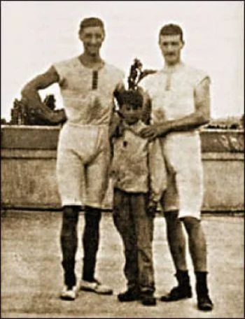
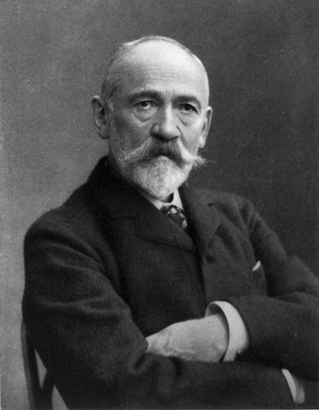
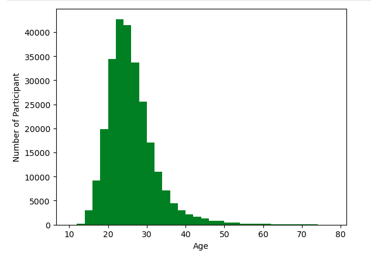
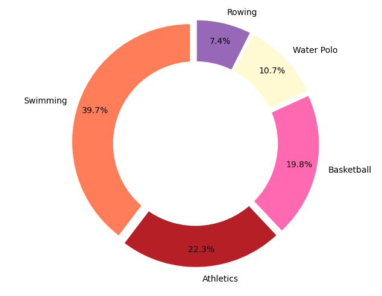
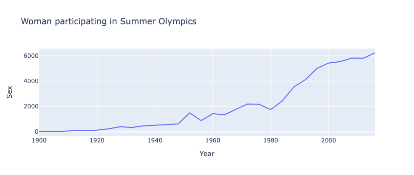
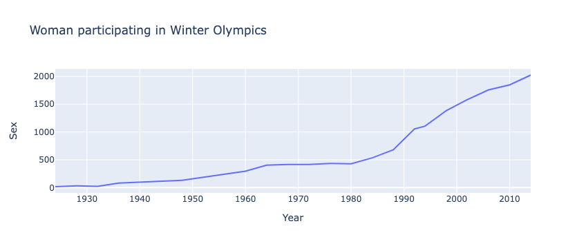

# Olympic Athletes
### (Athens 1896 - Rio 2016:A sprint through the years)

## Project Objective
    Worked with a historical dataset on the modern Olympic Games, which includes all the games from Athens 1896 to Rio 2016. The data was scraped from www.sports-reference.com in May 2018.

    The dataset athlete_events.csv contains 271’116 rows and 15 columns. Each row corresponds to an individual athlete competing in an individual Olympic event. Our goal is to create a machine learning model that predicts the winner of Olympic games.

### Methods Used
* Machine Learning
* Data Visualization
* Predictive Modeling

### Technologies
* Python
* Pandas, jupyter, numpy
* plotly, seaborn, matplotlib
* geopandas
* sklearn, pycaret

## Project Description
### Our work flow: 
    Approach: Supervised ML
    Classes: Gold/Silver/Bronze/NoMedal
    Clean data and make decisions
        -Use National Olympic Committees (NOC),not countries
        -Remove Year, but not City
    Find the best models with PyCaret
    Fix imbalance, check feature importance
    Manual tuning on the selected models
    Visualize data
    Develop story incl. fun-facts

### Data Insights: Olympic Outliers
    Youngest participant ever -  Dimitrios Loundras (Greece), Athens 1896 - 10 years Bronze in Gymnastics Men's Parallel Bars, Teams

    
    Age of the oldest participant ever - John Quincy Adams Ward (USA) - 97 years
    

    USA & Soviet Union in the Lead
    
.png)
 
    Number of participants according to the age
    

    US goldmedals per category
     

    Participation of Women through out the Summer Olympics

    Participation of Women through out the Winter Oympics
    
 

#### Other Members:

 - [Alexej Khalilzada](https://github.com/alexej-khalilzada)
